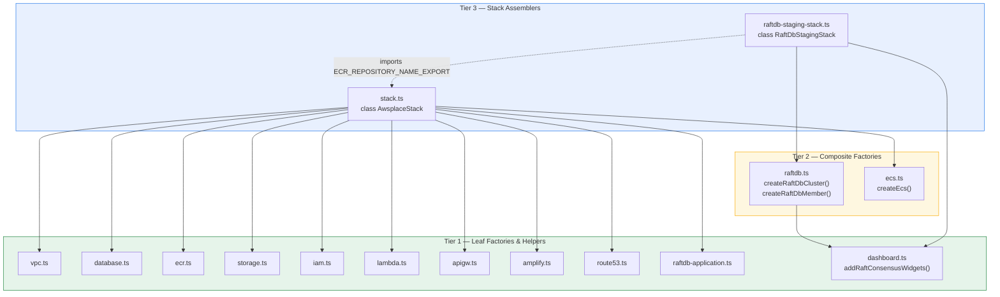
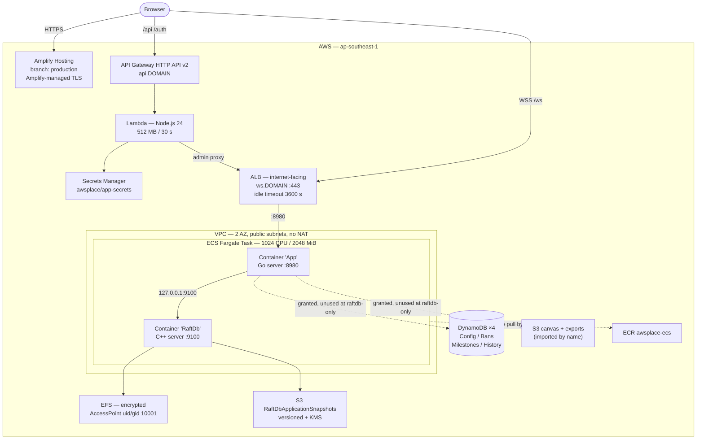
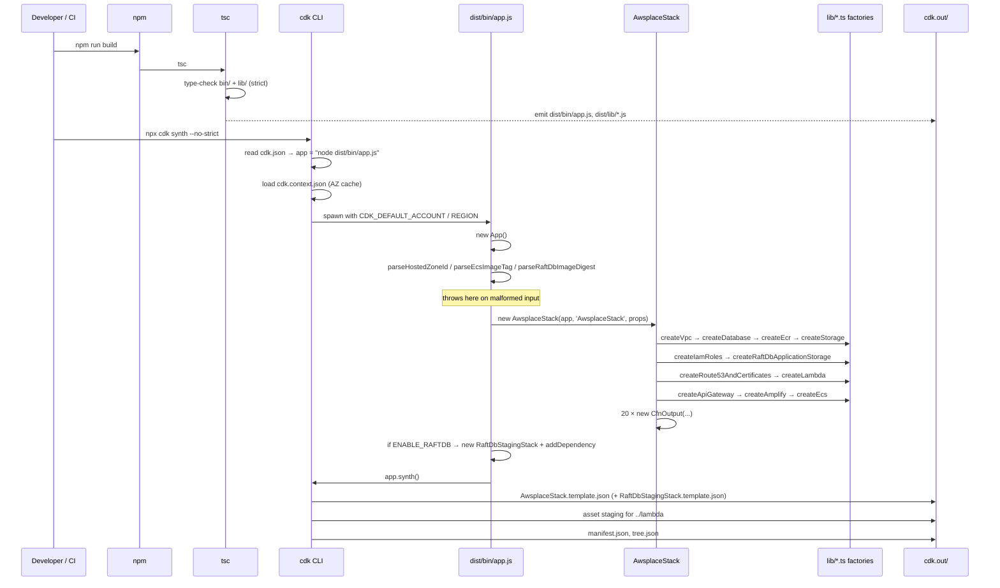
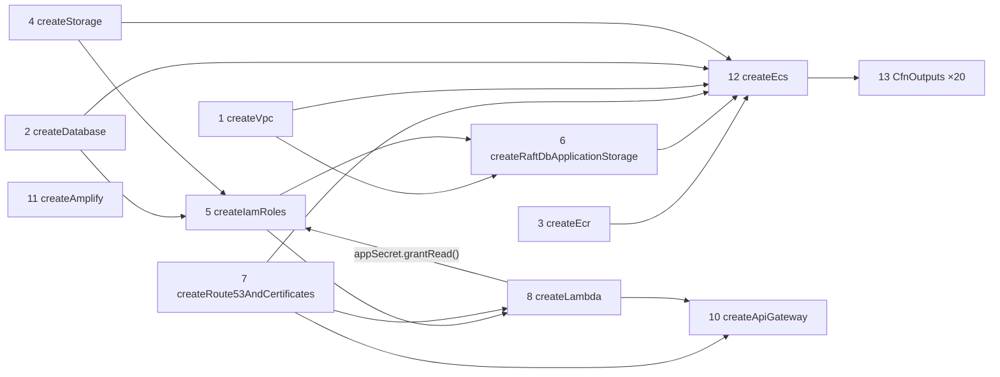
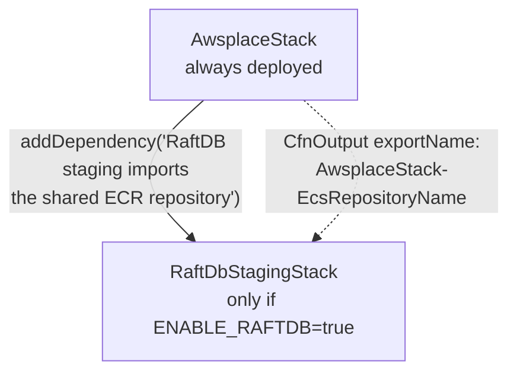
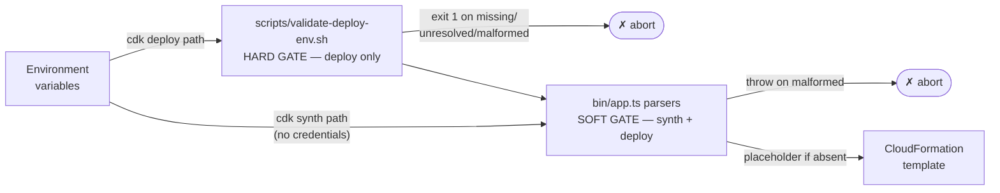
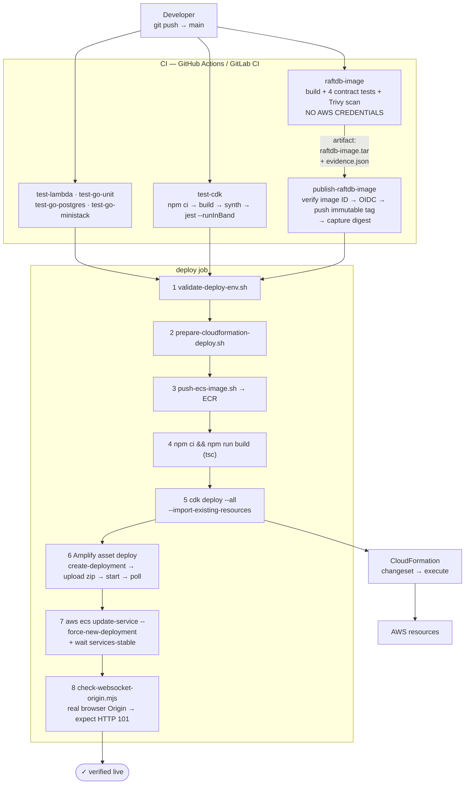
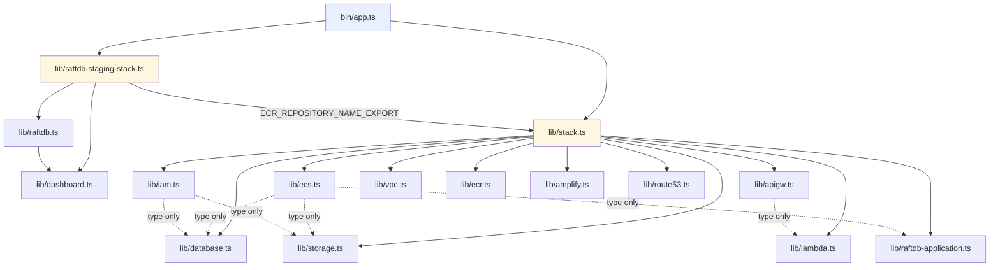

{}
⚠️ **Lưu ý:** Các thông tin dưới đây chỉ nhằm mục đích tham khảo, vui lòng **không sao chép nguyên văn** cho bài báo cáo của bạn kể cả warning này.
{}


### Mục tiêu tuần 1:

* Kết nối, làm quen với các thành viên trong First Cloud AI Journey.
* Hiểu dịch vụ AWS cơ bản, cách dùng console & CLI.

### Các công việc cần triển khai trong tuần này:
| Thứ | Công việc                                                                                                                                                                                   | Ngày bắt đầu | Ngày hoàn thành | Nguồn tài liệu                            |
| --- | ------------------------------------------------------------------------------------------------------------------------------------------------------------------------------------------- | ------------ | --------------- | ----------------------------------------- |
| 2   | - Làm quen với các thành viên FCAJ <br> - Đọc và lưu ý các nội quy, quy định tại đơn vị thực tập                                                                                             | 11/08/2025   | 11/08/2025      |
| 3   | - Tìm hiểu AWS và các loại dịch vụ <br>&emsp; + Compute <br>&emsp; + Storage <br>&emsp; + Networking <br>&emsp; + Database <br>&emsp; + ... <br>                                            | 12/08/2025   | 12/08/2025      | <https://cloudjourney.awsstudygroup.com/> |
| 4   | - Tạo AWS Free Tier account <br> - Tìm hiểu AWS Console & AWS CLI <br> - **Thực hành:** <br>&emsp; + Tạo AWS account <br>&emsp; + Cài AWS CLI & cấu hình <br> &emsp; + Cách sử dụng AWS CLI | 13/08/2025   | 13/08/2025      | <https://cloudjourney.awsstudygroup.com/> |
| 5   | - Tìm hiểu EC2 cơ bản: <br>&emsp; + Instance types <br>&emsp; + AMI <br>&emsp; + EBS <br>&emsp; + ... <br> - Các cách remote SSH vào EC2 <br> - Tìm hiểu Elastic IP   <br>                  | 14/08/2025   | 15/08/2025      | <https://cloudjourney.awsstudygroup.com/> |
| 6   | - **Thực hành:** <br>&emsp; + Tạo EC2 instance <br>&emsp; + Kết nối SSH <br>&emsp; + Gắn EBS volume                                                                                         | 15/08/2025   | 15/08/2025      | <https://cloudjourney.awsstudygroup.com/> |


### Kết quả đạt được tuần 1:

* Hiểu AWS là gì và nắm được các nhóm dịch vụ cơ bản: 
  * Compute
  * Storage
  * Networking 
  * Database
  * ...

* Đã tạo và cấu hình AWS Free Tier account thành công.

* Làm quen với AWS Management Console và biết cách tìm, truy cập, sử dụng dịch vụ từ giao diện web.

* Cài đặt và cấu hình AWS CLI trên máy tính bao gồm:
  * Access Key
  * Secret Key
  * Region mặc định
  * ...

* Sử dụng AWS CLI để thực hiện các thao tác cơ bản như:

  * Kiểm tra thông tin tài khoản & cấu hình
  * Lấy danh sách region
  * Xem dịch vụ EC2
  * Tạo và quản lý key pair
  * Kiểm tra thông tin dịch vụ đang chạy
  * ...

* Có khả năng kết nối giữa giao diện web và CLI để quản lý tài nguyên AWS song song.
* ...

 -->
# CDK Project Structure — `awsplace` Infrastructure-as-Code

> **Scope of this document.** Every statement below is derived from direct inspection of the files under `D:\HK252\AWS\awsplace\cdk` plus the deployment scripts in `scripts/` and the CI workflows in `.github/workflows/` and `.gitlab-ci.yml` that drive them. Where the repository's own prose documentation (`cdk/README.md`, `cdk/AGENTS.md`) disagrees with the compiled source, the source is treated as authoritative and the divergence is flagged explicitly in §14.

---

## 1. Overall Architecture

### 1.1 The organising principle: factory functions, not construct classes

The single most consequential architectural decision in this project is visible the moment you open `cdk/lib/`: **there are no custom `Construct` subclasses anywhere in the codebase.** A conventional CDK project of this size would typically declare a hierarchy such as `class NetworkingConstruct extends Construct`, `class ComputeConstruct extends Construct`, and compose them inside a stack. This project deliberately does not.

Instead, every infrastructure module exports a plain **factory function** that receives the stack itself as its `scope` argument, instantiates L2 constructs directly into that scope, and returns a typed record of the resources it created. The canonical shape is:

```typescript
// cdk/lib/vpc.ts
export interface VpcOutput { vpc: ec2.Vpc; }

export function createVpc(scope: Construct): VpcOutput {
  const vpc = new ec2.Vpc(scope, 'AwsplaceVpc', { /* ... */ });
  return { vpc };
}
```

This pattern is applied with near-total consistency across eleven of the thirteen files in `lib/`: `createVpc`, `createDatabase`, `createEcr`, `createStorage`, `createIamRoles`, `createLambda`, `createApiGateway`, `createAmplify`, `createEcs`, `createRoute53AndCertificates`, `createRaftDbApplicationStorage`, `createRaftDbCluster`, and `createRaftDbMember`. The `cdk/AGENTS.md` knowledge base records this as an explicit convention: *"Construct factories, not classes: each module exports a `create*()` function returning typed output objects."*

The architectural consequence is significant and worth stating plainly. Because the factories receive the **stack** as `scope` rather than creating an intermediate construct node, **the CloudFormation logical IDs are flat**. A construct class would nest resources under a path prefix — `AwsplaceStack/Networking/AwsplaceVpc/Resource` — producing logical IDs like `NetworkingAwsplaceVpc7A3B21C4`. With factory functions, the path is `AwsplaceStack/AwsplaceVpc/Resource`, yielding `AwsplaceVpc7A3B21C4`.

This flatness is not incidental; it is load-bearing. The test suite depends on it directly. `cdk/raftdb.test.cjs` filters synthesised resources by logical-ID prefix:

```javascript
function memberTaskDefEntries(template) {
  const entries = resourceEntriesByType(template, 'AWS::ECS::TaskDefinition')
    .filter(([id]) => /^raftdb\d+TaskDef/.test(id));
  expect(entries).toHaveLength(3);
  return entries;
}
```

Introducing a wrapper `Construct` would change every logical ID, which in CloudFormation semantics means **destroying and recreating every resource in the stack**. For a stack that owns an encrypted EFS filesystem holding a Raft write-ahead log, that is a data-loss event. The flat-factory choice therefore encodes a deliberate stability guarantee, and the tests enforce it.

### 1.2 Two stacks with asymmetric roles

The application declares exactly two `Stack` subclasses:

| Stack class | File | Instantiation | Role |
|---|---|---|---|
| `AwsplaceStack` | `lib/stack.ts:29` | Always | The complete production application |
| `RaftDbStagingStack` | `lib/raftdb-staging-stack.ts:50` | Only when `ENABLE_RAFTDB === 'true'` | A **disposable** qualification and drill environment |

These are not `dev`/`prod` variants of the same template — a common CDK idiom this project explicitly rejects. They are structurally different stacks serving different purposes. `AwsplaceStack` runs the real service; `RaftDbStagingStack` exists solely so that operators can rehearse Raft membership changes, snapshot restores, and failure injection against throwaway infrastructure without endangering production data. The `docs/raftdb/deployment-architecture.md` decision record states the constraint that motivates this split:

> Staging and production use separate runtime stacks, VPCs, buckets, keys, service discovery namespaces, security groups, and data. The application stack's ECR repository is the single intentional shared image-promotion dependency.

That "single intentional shared dependency" is realised concretely. `lib/stack.ts` exports a named constant and publishes the ECR repository name as a CloudFormation **export**:

```typescript
// lib/stack.ts:27
export const ECR_REPOSITORY_NAME_EXPORT = 'AwsplaceStack-EcsRepositoryName';

// lib/stack.ts:94
new CfnOutput(this, 'EcsRepositoryName', {
  value: repository.repositoryName,
  exportName: ECR_REPOSITORY_NAME_EXPORT,
});
```

The staging stack imports it via `Fn.importValue`, and the two constants are bound at compile time by a TypeScript import rather than by a duplicated string literal:

```typescript
// lib/raftdb-staging-stack.ts:12, 131-135
import { ECR_REPOSITORY_NAME_EXPORT } from './stack.js';
// ...
const ecrRepository = ecr.Repository.fromRepositoryName(
  this, 'SharedEcrRepository', Fn.importValue(ECR_REPOSITORY_NAME_EXPORT),
);
```

This is a genuinely careful piece of design: a typo in the export name becomes a TypeScript compilation error rather than a deployment-time `No export named ... found` failure.

### 1.3 The layering: three tiers within `lib/`

Although the project has no directory-level layering (everything sits flat in `lib/`), a three-tier dependency structure is nonetheless present and can be recovered by reading the import graph:



**Tier 1** modules are self-contained: they create resources and return them, with no knowledge of other modules except through their typed input interfaces. **Tier 2** modules are composite — `raftdb.ts` in particular is a two-phase factory where `createRaftDbCluster()` builds shared infrastructure and returns a `RaftDbClusterResources` bundle that is then threaded into repeated `createRaftDbMember()` calls. **Tier 3** are the two `Stack` classes, whose entire job is ordering and wiring.

`dashboard.ts` is the one module that breaks the `create*()` naming convention, and deliberately so: `addRaftConsensusWidgets(dashboard, clusterName, nodeIds)` **mutates an existing dashboard** rather than creating one. It is a decorator over a resource another module owns.

### 1.4 Deployment architecture that the CDK produces

The synthesised production topology is a single-task, sidecar-based deployment:



Two properties of this topology deserve emphasis because they explain otherwise-surprising CDK code.

**First, RaftDB is a sidecar, not a service.** `lib/ecs.ts` places both containers in one `FargateTaskDefinition` and enforces boot ordering:

```typescript
// lib/ecs.ts:155-158
appContainer.addContainerDependencies({
  container: raftDbContainer,
  condition: ecs.ContainerDependencyCondition.HEALTHY,
});
```

The Go application connects over loopback (`RAFTDB_ADDR: '127.0.0.1:9100'`). This eliminates network hops on the pixel-placement hot path and, critically, means the database never traverses the VPC — satisfying the security constraint in `deployment-architecture.md` that *"the RaftDB binary protocol is never routed outside the VPC."*

**Second, the deployment configuration is inverted from CDK defaults.** Normally one wants overlapping tasks during a rolling deploy. Here:

```typescript
// lib/ecs.ts:164-166
// A single raftdb writer owns the EFS WAL. Stop it before replacement;
// overlapping tasks would open the same durable files concurrently.
minHealthyPercent: 0,
maxHealthyPercent: 100,
```

Accepting a hard downtime window is the correct trade: two tasks concurrently opening the same write-ahead log on EFS would corrupt it. The comment in the source states the reasoning, and `deployment-contract.test.cjs:84-89` asserts the values so a well-meaning future change cannot silently reintroduce overlap.

---

## 2. Root Directory Structure

The CDK application lives in a single subdirectory of a larger polyglot monorepo. The tree below is generated from the actual filesystem and `git ls-files`; nothing is inferred.

```
awsplace/                                  # monorepo root
│
├── cdk/                                   # ◄── THE CDK APPLICATION
│   ├── bin/
│   │   └── app.ts                         # CDK App entry point (91 lines)
│   │
│   ├── lib/                               # All infrastructure modules (flat, 15 files)
│   │   ├── stack.ts                       # class AwsplaceStack — main orchestrator
│   │   ├── raftdb-staging-stack.ts        # class RaftDbStagingStack — disposable
│   │   ├── vpc.ts                         # createVpc()
│   │   ├── iam.ts                         # createIamRoles()
│   │   ├── database.ts                    # createDatabase()
│   │   ├── ecr.ts                         # createEcr()
│   │   ├── storage.ts                     # createStorage()
│   │   ├── route53.ts                     # createRoute53AndCertificates()
│   │   ├── lambda.ts                      # createLambda()
│   │   ├── apigw.ts                       # createApiGateway()
│   │   ├── amplify.ts                     # createAmplify()
│   │   ├── ecs.ts                         # createEcs()
│   │   ├── raftdb-application.ts          # createRaftDbApplicationStorage()
│   │   ├── raftdb.ts                      # createRaftDbCluster(), createRaftDbMember()
│   │   └── dashboard.ts                   # addRaftConsensusWidgets()
│   │
│   ├── raftdb.test.cjs                    # 1026 lines — largest test
│   ├── raftdb-workflow.test.cjs           #  275 lines — CI/CD contract
│   ├── deployment-contract.test.cjs       #  200 lines — ECR/ECS/frontend contract
│   ├── deploy-config.test.cjs             #  156 lines — env validation + CFN preparer
│   ├── raftdb-application-modes.test.cjs  #  102 lines — docs-as-tests
│   ├── raftdb-runbook.test.cjs            #   93 lines — docs-as-tests
│   ├── amplify.test.cjs                   #   35 lines — Amplify vs CloudFront
│   │
│   ├── cdk.json                           # app command + 2 feature flags
│   ├── cdk.context.json                   # cached AZ lookup (account 611619957191)
│   ├── package.json                       # type: module, aws-cdk-lib ^2.150.0
│   ├── package-lock.json
│   ├── tsconfig.json                      # strict, ES2022, NodeNext
│   ├── Dockerfile                         # node:24 + AWS CLI v2 + CDK toolchain
│   ├── README.md                          # 372 lines of operator documentation
│   ├── AGENTS.md                          # 76-line machine-readable knowledge base
│   └── scan_unicode.py                    # non-ASCII source auditor (utility)
│
├── lambda/                                # ◄── Lambda source, referenced as an ASSET
│   ├── index.js                           # export const handler
│   ├── app.js                             # Express app + CORS middleware
│   ├── auth.js                            # Discord OAuth + JWT
│   ├── admin-proxy.js                     # forwards /api/admin/* to the ALB
│   ├── local.js                           # local dev server
│   ├── package.json / package-lock.json
│   └── tests/                             # Vitest suite (not run by CDK)
│
├── scripts/                               # ◄── Deployment orchestration around CDK
│   ├── validate-deploy-env.sh             # pre-flight env-var gate
│   ├── prepare-cloudformation-deploy.sh   # failed-stack reconciliation
│   ├── ensure-ecr-repository.sh           # idempotent ECR bootstrap
│   ├── push-ecs-image.sh                  # tag + push + digest verification
│   ├── build-frontend.sh                  # token injection → dist/
│   ├── check-websocket-origin.mjs         # post-deploy browser-origin probe
│   ├── start-ministack.sh / reset-ministack.sh
│
├── dist/                                  # ◄── frontend build output (Amplify asset)
├── go-ecs/                                # Go application (Docker image → ECR)
├── raftdb/                                # C++ database (Docker image → ECR)
├── docs/raftdb/                           # 9 runbooks — ASSERTED BY CDK TESTS
├── .github/workflows/deploy.yml           # primary CI — ASSERTED BY CDK TESTS
└── .gitlab-ci.yml                         # mirror CI — ASSERTED BY CDK TESTS
```

### Directories that a reader might expect but which do **not** exist

This absence is itself a structural fact and should be documented rather than glossed over:

| Conventional directory | Present? | Where the responsibility actually lives |
|---|:--:|---|
| `cdk/constructs/` | **No** | No custom `Construct` subclasses exist; `lib/*.ts` factory functions replace them |
| `cdk/stacks/` | **No** | Both `Stack` classes live in `lib/` alongside the factories |
| `cdk/test/` or `cdk/__tests__/` | **No** | The seven `*.test.cjs` files sit at the `cdk/` root |
| `cdk/config/` | **No** | Configuration is read from `process.env` inline in `bin/app.ts` and `lib/lambda.ts` |
| `cdk/src/` | **No** | `bin/` + `lib/` only, per `tsconfig.json` `include` |
| `cdk/assets/` | **No** | The only asset is `lambda/`, referenced by relative path `'../lambda'` |
| `cdk/utils/` | **No** | No shared utility module; helper functions are file-local |
| `cdk/lambda/` | **No** | Lambda source is at the **monorepo root**, outside `cdk/` |

The last row is a genuine cross-boundary dependency worth highlighting: `lib/lambda.ts:56` calls `lambda.Code.fromAsset('../lambda')`, a path resolved relative to the CDK working directory. The CDK application therefore cannot be relocated, nor can `cdk synth` be invoked from a different working directory, without breaking asset bundling.

---

## 3. Detailed Folder Explanation

### 3.1 `cdk/bin/` — the executable entry point

**Purpose.** `bin/app.ts` is the single file CDK executes. Its 91 lines do four things: construct the `App`, resolve and validate all external configuration, instantiate stacks, and call `app.synth()`.

**Responsibilities.** Uniquely in this project, `bin/app.ts` is where **all input validation lives**. Rather than allowing malformed configuration to reach CloudFormation, it defines four dedicated parser functions that throw at synthesis time:

| Function | Line | Validates | Regex / rule |
|---|---|---|---|
| `parseHostedZoneId` | 13 | Route 53 zone ID | `/^Z[A-Z0-9]+$/` |
| `parseNodeCount` | 30 | Raft voter count | must be exactly `1` or `3` |
| `parseRestoreFromS3` | 39 | Restore flag | literal `'true'` or `'false'` only |
| `parseEcsImageTag` | 49 | Docker tag | `/^[A-Za-z0-9_][A-Za-z0-9_.-]{0,127}$/` |
| `parseRaftDbImageDigest` | 59 | Image digest | `/^sha256:[0-9a-f]{64}$/` |

The error messages are written for a CI operator rather than a developer. `parseHostedZoneId` explains the most likely cause of failure:

```typescript
throw new Error(
  'HOSTED_ZONE_ID must be a Route 53 hosted zone ID such as Z1234567890ABC; ' +
  'check that CI did not pass an unresolved variable reference'
);
```

That message targets a specific real failure mode: GitLab CI jobs that redeclare `HOSTED_ZONE_ID: ${HOSTED_ZONE_ID}`, causing the literal string `${HOSTED_ZONE_ID}` to be passed through. `deploy-config.test.cjs:102-111` executes the compiled `dist/bin/app.js` with exactly that poisoned value and asserts the process exits non-zero.

**The dual-mode default strategy.** A subtle and well-reasoned decision appears in the fallbacks. Both `parseHostedZoneId` and `parseRaftDbImageDigest` return **structurally valid placeholders** when their variables are absent:

```typescript
const SYNTHESIS_HOSTED_ZONE_ID = 'Z00000000000000000000';
const digest = value?.trim() || `sha256:${'0'.repeat(64)}`;
```

The comments explain why: *"Keep credential-free local/test synthesis possible. Deployment workflows run `scripts/validate-deploy-env.sh` before invoking CDK."* This creates a deliberate two-gate model. `cdk synth` must succeed on a developer laptop or in a CI job with no AWS credentials, so the test suite can inspect the template. But `cdk deploy` must never proceed on placeholders — so the *real* enforcement is delegated outward to a shell script that runs first. The validation is not weaker; it is relocated to the boundary where it belongs.

**Relationship to other folders.** `bin/` imports only `lib/stack.js` and `lib/raftdb-staging-stack.js`. It never touches a leaf factory. This keeps the entry point readable at a glance: read `bin/app.ts` and you know exactly which stacks exist and what configures them.

### 3.2 `cdk/lib/` — the infrastructure modules

**Purpose.** A flat namespace of fifteen TypeScript files: two stack classes and thirteen factory modules.

**Why flat?** With fifteen files, a nested taxonomy (`lib/networking/`, `lib/compute/`, `lib/data/`) would add path depth without reducing cognitive load — and, as established in §1.1, would risk logical-ID churn if it were ever expressed as construct nesting. The flat layout keeps every module one `import` away and makes the wiring in `stack.ts` scannable in a single screen.

**The uniform module contract.** Almost every file follows an identical four-part shape, which makes the codebase highly predictable:

1. An exported `XInput` interface (the dependencies this module requires)
2. An exported `XOutput` interface (the resources it produces)
3. An exported `createX(scope, input): XOutput` function
4. Zero side effects outside `scope`

`lib/ecs.ts` is the fullest expression:

```typescript
export interface EcsInput {
  vpc: ec2.Vpc;  ecrRepo: ecr.IRepository;  imageTag: string;
  ecsTaskExecutionRole: iam.Role;  ecsTaskRole: iam.Role;
  db: DatabaseOutput;  storage: StorageOutput;
  appSecret: secretsmanager.ISecret;  wildcardCert: acm.ICertificate;
  hostedZone: route53.IHostedZone;  domainName: string;
  raftDbImageDigest: string;  raftDb: RaftDbApplicationStorage;
}
export interface EcsOutput {
  cluster: ecs.Cluster;  service: ecs.FargateService;
  taskDefinition: ecs.FargateTaskDefinition;
  alb: elbv2.ApplicationLoadBalancer;
  albSecurityGroup: ec2.SecurityGroup;  ecsSecurityGroup: ec2.SecurityGroup;
}
```

Note the deliberate use of **interface types** (`ecr.IRepository`, `acm.ICertificate`, `secretsmanager.ISecret`) for imported resources versus **concrete types** (`ec2.Vpc`, `iam.Role`) for owned ones. This is not cosmetic: it is what allows `raftdb-staging-stack.ts` to pass an `Fn.importValue`-derived repository into the same `createRaftDbCluster` signature that would accept a locally-created one.

**Notable individual modules.**

`lib/amplify.ts` contains the single densest piece of domain knowledge in the CDK codebase — a hand-authored SPA rewrite regex with a 20-line explanatory comment:

```typescript
const SPA_REWRITE_SOURCE =
  '</^[^.]+$|\\.(?!(css|gif|ico|jpg|js|png|txt|svg|woff|woff2|ttf|map|json|webmanifest|html)$)([^.]+$)/>';
```

The comment explains that this mirrors Amplify's built-in `SINGLE_PAGE_APPLICATION_REDIRECT` but *adds `html` to the extension allowlist*, so that `/admin.html` is served as a real file instead of being rewritten to the canvas shell. Without that one token, the admin dashboard would silently break. The comment also documents a second hazard — that Amplify creates its own Route 53 records and duplicating them in CloudFormation causes a *"record set already exists"* failure — and `amplify.test.cjs:28-35` asserts no `AmplifyTrafficRecord*` resource exists in the template.

`lib/raftdb.ts` is the only module implementing a genuine **parameterised topology**. A `nodeCount` of `1` versus `3` changes the subnet type, whether an NLB exists, whether VPC interface endpoints are created, and whether tasks receive public IPs:

```typescript
const isolatedSubnets = nodeCount === 1
  ? { subnetType: ec2.SubnetType.PUBLIC }
  : { subnetType: ec2.SubnetType.PRIVATE_ISOLATED };
```

`lib/dashboard.ts` is documentation-heavy and functionally dormant. Its header comment is explicit:

> **IMPORTANT:** These metric names match the Task 30 planned emission contract. Panels are dormant until the Raft runtime actually publishes the values.

`raftdb.test.cjs:1007` contains a test literally named `'consensus telemetry remains un-emitted (blocked until raft runtime integration)'` — the project asserts its own incompleteness rather than pretending the metrics work.

### 3.3 `cdk/*.test.cjs` — the contract test suite

**Purpose.** Seven Jest test files totalling roughly 1,890 lines — more test code than the ~1,500 lines of `lib/` source they cover.

**Why `.cjs`?** `package.json` declares `"type": "module"`, making every `.js` file an ES module. Jest's default runtime is CommonJS. The `.cjs` extension opts individual files back into CommonJS so `require()` works. This is a pragmatic workaround, not an oversight.

**The testing strategy: synthesise, then walk the template.** There are no unit tests on CDK constructs and no mocked AWS SDK. Every test runs a real `cdk synth` and asserts against the resulting CloudFormation JSON:

```javascript
// raftdb.test.cjs:17-32
function synth(outDir, env) { /* spawnSync of node_modules/.bin/cdk synth */ }
function resourcesByType(template, type) {
  return Object.values(template.Resources).filter((r) => r.Type === type);
}
```

`raftdb.test.cjs` synthesises the staging stack **three times** in `beforeAll` — normal, restore-mode, and post-restore — so it can assert on state transitions between generations. This is why `package.json` mandates `--runInBand`: parallel Jest workers would race on the shared `cdk.out/` directory.

**Four categories of assertion.** The suite covers markedly more than resource shapes:

1. **Template shape** — e.g. `'staging synthesizes exactly three ECS fargate services'`, `'each member uses a dedicated EFS access point at a distinct path'`.
2. **Negative synthesis** — `'invalid ECS image tags fail synthesis before deployment'` asserts a *non-zero exit code* and a specific stderr message.
3. **CI/CD workflow contracts** — `deployment-contract.test.cjs:157` reads both `.gitlab-ci.yml` and `.github/workflows/deploy.yml` as text and asserts each contains `--import-existing-resources`, `aws ecs wait services-stable`, and *does not* contain `aws ecs list-clusters` (forcing the use of exact stack outputs rather than fuzzy lookups).
4. **Documentation-as-tests** — `raftdb-runbook.test.cjs` and `raftdb-application-modes.test.cjs` read Markdown from `docs/raftdb/` and assert it contains required content:

```javascript
// raftdb-runbook.test.cjs:19-24
expect(runbook).toMatch(/npx cdk destroy RaftDbStagingStack/);
expect(runbook).toMatch(/never (?:run|use) .*--all/i);
expect(runbook).toMatch(/do not destroy `?AwsplaceStack`?/i);
```

This fourth category is unusual and genuinely notable: the operational runbook cannot drift out of date without turning the CDK build red.

**Cross-boundary shell testing.** `deploy-config.test.cjs:30-78` builds a **mock `aws` binary** in a temp directory, prepends it to `PATH`, and drives `prepare-cloudformation-deploy.sh` through four CloudFormation states, asserting which AWS calls were made. Notably it verifies the script *refuses* to delete an `UPDATE_ROLLBACK_FAILED` stack — the state that has a prior stable deployment worth preserving.

### 3.4 `cdk/` root configuration files

**`cdk.json`** is minimal, and its most important line is the `app` command:

```json
{ "app": "node dist/bin/app.js", "watch": { ... }, "context": {
    "@aws-cdk/core:newStyleStackSynthesis": true,
    "@aws-cdk/core:stackRelativeExports": true } }
```

The app command points at **compiled JavaScript**, not `npx ts-node bin/app.ts`. This has a direct operational consequence: **`tsc` must run before any CDK command**, which is why `package.json`'s `test` script chains `npm run build && npm run synth && jest`. A developer who edits `lib/ecs.ts` and immediately runs `npx cdk synth` will silently synthesise the *previous* build. This is the most likely source of confusion for a newcomer to the project.

The `context` block contains only two aws-cdk feature flags — no application configuration.

**`cdk.context.json`** holds one cached lookup, the availability zones for account `611619957191` in `ap-southeast-1`. It is committed so that synthesis is deterministic and credential-free, which is precisely what the test suite requires.

**`tsconfig.json`** enables `strict: true`, `declaration: true`, and `module: NodeNext`. The `include` array is `["bin/**/*.ts", "lib/**/*.ts"]` — the `.cjs` tests are deliberately outside the type-checked surface.

**`Dockerfile`** builds a `node:24-bookworm` image with AWS CLI v2 and a global `aws-cdk` install. Its trailing comment gives the intended invocation:

```
# Build using docker build -t aws-bootstrap -f cdk/Dockerfile .
# Lauch using docker run -it --rm -v $(pwd):/workspace -w /workspace/cdk aws-bootstrap
```

This is a developer-convenience toolchain container for bootstrapping, not part of the deployed artefacts.

**`scan_unicode.py`** is a 114-line standalone auditor that walks a directory and reports every non-ASCII codepoint with its Unicode category and name. It is not wired into `package.json` or CI. Its presence is explicable from the wider project context: the brand name is `lẩu/Place` and user-facing strings are Vietnamese, so homoglyph and encoding hygiene in infrastructure source is a real concern. Its exact intended workflow could not be verified from the codebase.

### 3.5 `scripts/` — the deployment harness surrounding CDK

Although outside `cdk/`, these scripts are inseparable from the CDK application: two are asserted by CDK tests, and one enforces the validation that `bin/app.ts` deliberately defers.

`validate-deploy-env.sh` is the **hard gate** that complements the soft placeholders in `bin/app.ts`. It requires nine variables, rejects unresolved `${VAR}` references, and enforces the digest and hosted-zone formats. It is careful never to echo a secret's value:

```bash
echo "ERROR: required deployment variable $variable_name is not set" >&2
```

`deploy-config.test.cjs:95-100` asserts this behaviour explicitly by checking that a missing `DISCORD_CLIENT_SECRET` produces a name-only error.

`prepare-cloudformation-deploy.sh` implements careful, asymmetric stack reconciliation. It deletes stacks in `CREATE_FAILED`, `ROLLBACK_COMPLETE`, `ROLLBACK_FAILED`, or `DELETE_FAILED` (all states with no successful deployment to preserve), retries deletion at most twice, and **explicitly refuses** to touch `UPDATE_ROLLBACK_FAILED`:

```bash
UPDATE_ROLLBACK_FAILED)
  echo "ERROR: $stack_name is UPDATE_ROLLBACK_FAILED and has a prior stable deployment; refusing to delete it automatically" >&2
  exit 1
```

`ensure-ecr-repository.sh` bootstraps the ECR repository **before** CDK runs, reconciling scanning, tag mutability, and lifecycle policy idempotently. This exists to break a chicken-and-egg cycle: CI must push an image before the stack that creates the repository has been deployed. It treats `RepositoryAlreadyExistsException` as success, making it safe under concurrent CI runs.

`push-ecs-image.sh` pushes both a versioned tag and `latest`, then re-reads both digests from ECR and **fails if they differ** — catching the case where a concurrent push moved `latest`.

---

## 4. CDK Entry Point

### 4.1 Identification

| Aspect | Value | Source |
|---|---|---|
| Entry file (source) | `cdk/bin/app.ts` | `tsconfig.json` `include` |
| Entry file (executed) | `cdk/dist/bin/app.js` | `cdk.json` `"app"` |
| App construction | `const app = new App();` | `bin/app.ts:6` |
| Shebang | `#!/usr/bin/env node` | `bin/app.ts:1` |
| Synthesis trigger | `app.synth();` | `bin/app.ts:90` |

Note that `new App()` receives **no props** — no `defaultStackSynthesizer`, no `context`, no `outdir`. All environment resolution happens at the stack level.

### 4.2 Environment configuration

```typescript
// bin/app.ts:8-11
const env = {
  account: process.env.CDK_DEFAULT_ACCOUNT,
  region: process.env.CDK_DEFAULT_REGION || 'ap-southeast-1',
};
```

`CDK_DEFAULT_ACCOUNT` and `CDK_DEFAULT_REGION` are injected by the CDK CLI from the resolved AWS credential chain. Because `account` has no fallback, it is `undefined` during credential-free synthesis, producing an **environment-agnostic** stack. This is what allows `cdk synth --no-strict` to succeed in a CI job with no AWS role assumed — and it is precisely why the `--no-strict` flag appears in every synth invocation across `package.json`, the tests, and both CI workflows.

The region default of `ap-southeast-1` (Singapore) is hardcoded, consistent with `cdk.context.json` and `docs/raftdb/deployment-architecture.md`.

### 4.3 Context loading — an important negative finding

**Verified by exhaustive grep across `cdk/bin`, `cdk/lib`, and all `.cjs` files: there is no call to `app.node.tryGetContext()`, `scope.node.tryGetContext()`, or `node.getContext()` anywhere in the project.**

Every runtime configuration value is read from `process.env`. The `context` block in `cdk.json` contains only two aws-cdk feature flags, and `cdk.context.json` contains only a cached AZ lookup.

This is a material divergence from the project's own documentation. `cdk/README.md` (lines 187–193, 225–233) documents a "Configuration Context Variables" table listing `hostedZoneId`, `domainName`, and `certificateArn`, and shows deploy commands passing them via `--context`:

```bash
npx cdk deploy --require-approval never \
  --context hostedZoneId=Z12345678ABCDEF \
  --context domainName=lauplace.namanhishere.com \
  --context certificateArn=arn:aws:acm:...
```

**These `--context` flags have no effect.** The values are read exclusively from the `HOSTED_ZONE_ID` and `DOMAIN_NAME` environment variables. The third variable, `certificateArn`, is not read at all under any mechanism — `lib/route53.ts` unconditionally *creates* a new wildcard `acm.Certificate`, and `lib/ecs.ts:195` consumes `wildcardCert.certificateArn` from that created resource. The README's statement that *"When no `certificateArn` is provided via context, the ALB listens on port 80 without HTTPS"* does not reflect the current `ecs.ts`, which always configures an HTTPS listener on 443 plus an HTTP-to-HTTPS redirect on 80.

The README appears to describe a superseded implementation. This is recorded here as a factual finding and revisited in §14.

### 4.4 Step-by-step: `cdk synth`



The critical ordering constraint is the first two steps. Because `cdk.json` runs compiled JavaScript, **`tsc` must precede every CDK invocation**. Skipping it synthesises a stale template.

### 4.5 Step-by-step: `cdk deploy` (as CI executes it)

The production sequence from `.github/workflows/deploy.yml:355-374` is a five-gate pipeline:

```bash
bash scripts/validate-deploy-env.sh                    # Gate 1
bash scripts/prepare-cloudformation-deploy.sh AwsplaceStack  # Gate 2
cd cdk && npm ci && npm run build                      # Gate 3
npx cdk deploy --require-approval never --no-strict --all --import-existing-resources
```

1. **Gate 1 — environment validation.** Nine variables checked for presence, unresolved-reference patterns, and format. `RAFTDB_IMAGE_DIGEST` must match `^sha256:[0-9a-f]{64}$`, which is what stops a placeholder digest from ever reaching AWS.

2. **Gate 2 — CloudFormation reconciliation.** Failed *initial creations* are deleted so CDK can recreate them; failed *updates* with prior stable state abort the pipeline.

3. **Gate 3 — compile.** `npm ci` for reproducible dependency resolution, then `tsc`.

4. **Deploy.** Four flags, each load-bearing:
   - `--require-approval never` — non-interactive CI; suppresses the IAM/security-group change prompt.
   - `--no-strict` — required because the app is environment-agnostic (`account: undefined`).
   - `--all` — deploys every stack in the app.
   - `--import-existing-resources` — **essential to this project's design.** Three resources carry `RemovalPolicy.RETAIN` with explicit physical names: the ECR repository `awsplace-ecs` (`ecr.ts`), the Secrets Manager secret `awsplace/app-secrets` (`lambda.ts`), and the RaftDB snapshot bucket (`raftdb.ts`). After a `cdk destroy`, these survive. Without this flag, the next deploy would fail with "already exists"; with it, CloudFormation re-adopts them. The comment in `ecr.ts` states the intent: *"CI publishes before the application stack is recreated, so the registry must survive `cdk destroy` and be auto-imported on the next deployment."*

5. **Post-deploy verification.** CI reads `EcsClusterName` and `EcsServiceName` from stack outputs (never `aws ecs list-clusters` — asserted against in `deployment-contract.test.cjs:171-172`), forces a new deployment, waits with `aws ecs wait services-stable`, and finally runs `scripts/check-websocket-origin.mjs` to confirm a real browser-origin WebSocket upgrade succeeds. That last probe exists because an origin-free health check would pass even when the `ALLOWED_ORIGINS` configuration is broken.

### 4.6 Bootstrapping

The project uses modern-style synthesis (`@aws-cdk/core:newStyleStackSynthesis: true`), which requires a bootstrapped environment. Bootstrapping is **not** performed by CI; `docs/raftdb/deployment-architecture.md` records it as a completed manual prerequisite:

> Live account verified: `aws sts get-caller-identity` returned account `611619957191`, region `ap-southeast-1`, three AZs (`1a`/`1b`/`1c`), CDKToolkit bootstrap **v32** present.

---

## 5. Stack Organization

### 5.1 `AwsplaceStack` — the production application

**Declaration:** `lib/stack.ts:29`, `export class AwsplaceStack extends Stack`

**Props interface** (`AwsplaceStackProps extends StackProps`):

| Prop | Type | Source | Purpose |
|---|---|---|---|
| `domainName` | `string` | `DOMAIN_NAME` env, default `place.namanhishere.com` | Root domain for Amplify, `api.`, `ws.` |
| `hostedZoneId` | `string` | `HOSTED_ZONE_ID` env (validated) | Route 53 zone for DNS + ACM validation |
| `ecsImageTag` | `string` | `ECS_IMAGE_TAG` env, default `latest` | Go application image tag |
| `raftDbImageDigest` | `string` | `RAFTDB_IMAGE_DIGEST` env (validated) | Immutable RaftDB image digest |

A notable TypeScript idiom appears in the constructor. The custom props are destructured out and only the remainder is forwarded to `super()`:

```typescript
const { domainName, hostedZoneId, ecsImageTag, raftDbImageDigest, ...stackProps } = props;
super(scope, id, stackProps);
```

This prevents application-level props from leaking into the CDK `StackProps` surface.

**Resources created** (grouped by the factory that produces them):

| Factory | AWS resources |
|---|---|
| `createVpc` | 1 VPC, 2 public subnets, IGW, route tables |
| `createDatabase` | 4 `AWS::DynamoDB::GlobalTable` (TableV2), 2 GSIs |
| `createEcr` | 1 ECR repository (`awsplace-ecs`, RETAIN) |
| `createStorage` | 0 resources — **imports** 2 buckets by name |
| `createIamRoles` | 3 IAM roles + inline policies |
| `createRaftDbApplicationStorage` | 1 EFS filesystem, 1 access point, 1 S3 bucket (versioned, autoDelete) |
| `createRoute53AndCertificates` | 1 ACM wildcard certificate; **imports** hosted zone |
| `createLambda` | 1 Lambda function, 1 Secrets Manager secret (RETAIN) |
| `createApiGateway` | 1 HTTP API, 1 custom domain, 1 API mapping, 1 A record |
| `createAmplify` | 1 Amplify App, 1 Branch, 1 Domain, 2 custom rules |
| `createEcs` | 2 security groups, 1 cluster, 1 task definition (2 containers), 1 service, 1 ALB, 2 listeners, 1 target group, 1 A record |

**Internal construction order** — this is a real dependency chain, not arbitrary sequencing:



Two edges deserve comment. `createIamRoles` must follow `createDatabase` and `createStorage` because it scopes policies to their concrete ARNs via the helper `allTableArns(db)`. And there is a **deliberate back-edge**: `createLambda` creates the secret, but the *ECS execution* role needs to read it, so `stack.ts:61` performs the grant after both exist:

```typescript
const lambda = createLambda(this, { iam: iamRoles, ecsAlbUrl: `https://ws.${domainName}` });
lambda.appSecret.grantRead(ecsTaskExecutionRole);
```

This back-edge is why the secret cannot simply be created inside `iam.ts` — it resolves a genuine circular dependency between the roles module and the Lambda module.

**Outputs** — twenty `CfnOutput` declarations. Only one carries an `exportName`:

`VpcId`, `EcsRepositoryUri`, **`EcsRepositoryName` (exported)**, `EcsClusterName`, `EcsServiceName`, `EcsTaskExecutionRoleArn`, `EcsTaskRoleArn`, `LambdaExecutionRoleArn`, `ApiFunctionArn`, `AppSecretArn`, `ConfigTableName`, `BansTableName`, `MilestonesTableName`, `HistoryTableName`, `CanvasBucketName`, `ExportsBucketName`, `RaftDbFileSystemId`, `RaftDbSnapshotBucketName`, `AmplifyAppId`, `AmplifyDefaultDomain`, `AmplifyBranchName` — plus `AlbDns`, `AlbSecurityGroupId`, `EcsSecurityGroupId` emitted from within `ecs.ts`, and `ApiGatewayUrl` from `apigw.ts`.

The `cdk/AGENTS.md` convention *"Output everything: every table, bucket, ARN, and DNS name is a `CfnOutput` for CI"* is fully observed. CI consumes `AmplifyAppId`, `AmplifyBranchName`, `EcsClusterName`, and `EcsServiceName` directly.

**Environment-specific behaviour.** `AwsplaceStack` has **no environment branching whatsoever** — no `if (isProd)`, no stage parameter. Every value is either hardcoded or supplied via props. Environment differentiation is achieved entirely by supplying different `DOMAIN_NAME` / `HOSTED_ZONE_ID` values and deploying to a different account. This is a defensible choice for a project with one production environment, and it keeps the synthesised template deterministic.

### 5.2 `RaftDbStagingStack` — the disposable qualification stack

**Declaration:** `lib/raftdb-staging-stack.ts:50`

**Instantiation:** conditional on `process.env.ENABLE_RAFTDB === 'true'` (`bin/app.ts:79`).

**Props** — all optional with defaults, unlike the main stack:

| Prop | Default | Validation |
|---|---|---|
| `imageDigest` | none | `^sha256:[0-9a-f]{64}$` — throws in constructor |
| `dataGeneration` | `'staging-1'` | lowercase DNS-label slug, 1–63 chars |
| `restoreFromS3` | `false` | if `true`, `dataGeneration` **must** start with `restore-` |
| `nodeCount` | `1` | must be `1` or `3` |

The restore-mode coupling is an unusually thoughtful safety interlock:

```typescript
if (restoreFromS3 && !dataGeneration.startsWith('restore-')) {
  throw new Error('RAFTDB_RESTORE_FROM_S3=true requires RAFTDB_DATA_GENERATION to start with restore-');
}
```

Because `dataGeneration` determines the EFS access-point path (`/raftdb/${dataGeneration}/member-${nodeId}`), forcing a fresh generation name guarantees a restore always lands in an **empty** directory. This mechanically enforces the architectural rule from `deployment-architecture.md` that *"Remote S3 recovery is an explicit operator mode allowed only with an empty local snapshot catalog and WAL directory; it never acts as a silent fallback for damaged local state."* The interlock cannot be bypassed by an operator in a hurry.

**Topology by `nodeCount`:**

| Aspect | `nodeCount: 1` | `nodeCount: 3` |
|---|---|---|
| VPC AZs | 1 | 3 |
| Subnets | `PUBLIC` | `PRIVATE_ISOLATED` |
| Public IP | `assignPublicIp: true` | `false` |
| Load balancer | none (direct TCP) | internal NLB + SG |
| VPC endpoints | none | ECR, ECR_DOCKER, CloudWatch Logs (interface) + S3 (gateway) |
| `RAFTDB_EXPECTED_VOTERS` | `'1'` | `'1,2,3'` |
| Client ingress on 9100 | `0.0.0.0/0` | client SG → NLB SG → task SG |

**Peer-to-peer security-group mesh.** The three-node mode builds an explicit N×(N−1) ingress mesh on the Raft peer port 9101:

```typescript
// raftdb-staging-stack.ts:151-160
for (let i = 0; i < nodeCount; i++) {
  const srcSGs = memberSGs.filter((_, j) => j !== i);
  for (const srcSg of srcSGs) {
    memberSGs[i].addIngressRule(srcSg, ec2.Port.tcp(NODE_PORT), /* ... */);
  }
}
```

Two tests police this: `'node-port 9101 accepts traffic only between member security groups'` and, importantly, the negative `'node-port 9101 is not reachable from client SG or CIDR'`.

**Per-member isolation.** `createRaftDbMember` gives each node its own EFS access point at a distinct path, its own IAM task role scoped to its own S3 prefix and access point, and its own subnet:

```typescript
taskRole.addToPrincipalPolicy(new iam.PolicyStatement({
  actions: ['s3:GetObject', 's3:PutObject'],
  resources: [snapshotBucket.arnForObjects(`${snapshotPrefix}/*`)],
}));
taskRole.addToPrincipalPolicy(new iam.PolicyStatement({
  actions: ['elasticfilesystem:ClientMount', 'elasticfilesystem:ClientWrite'],
  resources: [fileSystem.fileSystemArn],
  conditions: { StringEquals: { 'elasticfilesystem:AccessPointArn': accessPoint.accessPointArn } },
}));
```

A compromised or buggy member 2 cannot read member 1's WAL or overwrite its snapshots. This is textbook least privilege applied at a per-instance granularity.

**Monitoring.** The staging stack creates substantially more observability than production: per-member CPU and memory alarms, a cluster-wide `MathExpression` max-snapshot-age alarm (threshold 900 s), a summed `WalErrors` alarm (threshold 0), per-member deployment-rollback alarms, an NLB healthy-target alarm, and a CloudWatch dashboard. Alarm `treatMissingData` is set to `NOT_BREACHING` on cold-start-sensitive alarms and `BREACHING` on the NLB liveness alarm — a distinction asserted by tests.

**Embedded operational documentation.** Lines 21–45 of `raftdb-staging-stack.ts` contain a boxed seven-step member-replacement procedure as a source comment, cross-referenced to `deployment-architecture.md`. Placing the runbook adjacent to the code that implements it is a deliberate choice to keep them synchronised.

### 5.3 Deployment order and cross-stack references



`bin/app.ts:87` declares the dependency with a human-readable reason string:

```typescript
stagingStack.addDependency(mainStack, 'RaftDB staging imports the shared ECR repository');
```

CloudFormation would infer this ordering from the `Fn::ImportValue` anyway, but the explicit call documents the intent and appears in `cdk diff` output. Only one cross-stack reference exists, and it is one-directional.

---

## 6. Construct Organization

### 6.1 The central finding

**This project defines zero custom `Construct` subclasses.** Verified: no file in `cdk/lib/` or `cdk/bin/` contains `extends Construct`. The only classes are the two `Stack` subclasses, and `Stack` itself extends `Construct` via the CDK framework.

The `constructs` package appears in `package.json` dependencies (`^10.3.0`) and `Construct` is imported in every `lib/*.ts` file — but exclusively as the **type of the `scope` parameter**, never as a base class:

```typescript
import { Construct } from 'constructs';
export function createVpc(scope: Construct): VpcOutput { ... }
```

Consequently, sections of the brief asking for "encapsulated resources, inputs, outputs" per construct are best answered by documenting the **factory functions that occupy the construct role**. Their interface contracts are as explicit as any construct's props would be — arguably more so, since both inputs and outputs are named exported interfaces.

### 6.2 The thirteen factory functions

| Function | File | Input | Output | Resources encapsulated |
|---|---|---|---|---|
| `createVpc` | `vpc.ts` | `Construct` | `VpcOutput` | VPC, 2 public subnets, IGW |
| `createDatabase` | `database.ts` | `Construct` | `DatabaseOutput` | 4 TableV2 + 2 GSI |
| `createEcr` | `ecr.ts` | `Construct` | `EcrOutput` | ECR repo + lifecycle rule |
| `createStorage` | `storage.ts` | `StorageProps` | `StorageOutput` | 2 imported `IBucket` |
| `createIamRoles` | `iam.ts` | `IamInput` | `IamOutput` | 3 roles + inline policies |
| `createRoute53AndCertificates` | `route53.ts` | `Route53AndCertInput` | `Route53AndCertOutput` | ACM wildcard cert; imported zone |
| `createLambda` | `lambda.ts` | `LambdaInput` | `LambdaOutput` | Lambda fn + Secret |
| `createApiGateway` | `apigw.ts` | `LambdaOutput`, `ApiGatewayInput` | `ApiGatewayOutput` | HttpApi, DomainName, ApiMapping, ARecord |
| `createAmplify` | `amplify.ts` | `AmplifyProps` | `AmplifyOutput` | App, Branch, Domain, 2 rules |
| `createEcs` | `ecs.ts` | `EcsInput` | `EcsOutput` | 2 SG, cluster, taskdef, service, ALB, 2 listeners, TG, ARecord |
| `createRaftDbApplicationStorage` | `raftdb-application.ts` | `{vpc, taskRole}` | `RaftDbApplicationStorage` | EFS, AccessPoint, S3 bucket |
| `createRaftDbCluster` | `raftdb.ts` | `RaftDbClusterProps` | `RaftDbClusterResources` | S3, namespace, SGs, endpoints, EFS, cluster, NLB, dashboard, qualification taskdef |
| `createRaftDbMember` | `raftdb.ts` | `RaftDbMemberProps` | `RaftDbMemberOutput` | AccessPoint, task role, taskdef, service, 2 alarms, 5 outputs |

`addRaftConsensusWidgets` (`dashboard.ts`) is the fourteenth exported function but is a mutator returning `void`.

### 6.3 The one genuinely reusable abstraction

Twelve of the thirteen factories are called exactly once. `createRaftDbMember` is called in a loop and is the only true reuse in the project:

```typescript
// raftdb-staging-stack.ts:192-206
for (let n = 1; n <= nodeCount; n++) {
  const member = createRaftDbMember(this, {
    nodeId: n, clusterResources, ecrRepo: ecrRepository,
    ecsTaskExecutionRole: executionRole, imageDigest, dataGeneration,
    restoreFromS3, subnet: subnets[idx], memberSecurityGroup: memberSGs[idx],
  });
  members.push(member);
}
```

This is a textbook **Factory Pattern**: identical structure parameterised by identity (`nodeId`), placement (`subnet`), and isolation boundary (`memberSecurityGroup`). Logical IDs are derived deterministically from ``nodeName = `raftdb-${nodeId}` ``, producing `raftdb-1TaskDef`, `raftdb-2Service`, and so on — which is exactly what the test regexes `/^raftdb\d+TaskDef/` match.

### 6.4 Why factories rather than construct classes?

Beyond the logical-ID stability argument in §1.1, three further justifications are supported by the code:

1. **Return-value richness.** A `Construct` subclass exposes resources as public readonly *properties*, which encourages consumers to reach into the construct. A factory returns a **typed record**, which the stack destructures and rewires explicitly. `stack.ts` reads as a linear data-flow program:
   ```typescript
   const { vpc } = createVpc(this);
   const db = createDatabase(this);
   const iamRoles = createIamRoles(this, { db, storage });
   ```
   Every dependency is visible at the call site.

2. **Two-phase composition without inheritance.** `createRaftDbCluster` → `createRaftDbMember` threads a `RaftDbClusterResources` bundle between phases. Expressing this with construct classes would require either a parent-child hierarchy (changing logical IDs) or the same explicit threading with extra ceremony.

3. **Testability against the flat template.** The entire test strategy walks `template.Resources` by logical-ID prefix. Factories keep those prefixes stable and predictable.

The trade-off is real and should be stated: these factories are **not publishable or reusable outside this application**. They cannot be consumed by another CDK app, cannot be unit-tested in isolation, and lack the lifecycle hooks (`Aspects`, validation, `node.addDependency` on the construct itself) that a `Construct` subclass provides. For a single-application repository, this is a reasonable trade; for a shared infrastructure library, it would not be.

---

## 7. Resource Organization

### 7.1 Mapping resource types to definition sites

| AWS service | Where defined | Count | Rationale for placement |
|---|---|---|---|
| **VPC / EC2** | `vpc.ts` (main), `raftdb-staging-stack.ts` (staging) | 2 VPCs | Each stack owns its own network — the isolation rule from `deployment-architecture.md` |
| **Security Groups** | `ecs.ts`, `raftdb.ts`, `raftdb-staging-stack.ts` | 8+ | Deliberately co-located with the resources they protect, not centralised |
| **VPC Endpoints** | `raftdb.ts` (3-node only) | 4 | Only isolated subnets need them; public-subnet tasks reach AWS directly |
| **DynamoDB** | `database.ts` | 4 tables | All four share PK/SK shape and on-demand billing |
| **S3** | `storage.ts` (imported), `raftdb-application.ts` (created), `raftdb.ts` (created) | 2 imported + 2 created | Split by ownership — see §7.2 |
| **EFS** | `raftdb-application.ts`, `raftdb.ts` | 2 filesystems | Durable WAL storage; per-member access points |
| **ECR** | `ecr.ts` | 1 repository | Single repo holds both `awsplace-ecs:<sha>` and `raftdb-<sha>` images |
| **ECS** | `ecs.ts` (app+sidecar), `raftdb.ts` (members) | 2 clusters | Production sidecar vs staging multi-service |
| **ALB** | `ecs.ts` | 1 | HTTP/HTTPS for the WebSocket endpoint |
| **NLB** | `raftdb.ts` (3-node only) | 0 or 1 | TCP for the binary RaftDB protocol |
| **Lambda** | `lambda.ts` | 1 function | Code asset from `../lambda` |
| **API Gateway** | `apigw.ts` | 1 HTTP API v2 | `$default` route delegates routing to Express |
| **IAM** | `iam.ts` (shared), `raftdb.ts` (per-member) | 3 + 3 + 2 roles | Shared roles centralised; per-member roles must live with the member |
| **Secrets Manager** | `lambda.ts` | 1 secret | Consumed by both Lambda (synth-time) and ECS (runtime) |
| **ACM** | `route53.ts` | 1 wildcard cert | `*.domainName` for `api.` and `ws.` |
| **Route 53** | `route53.ts` (zone import), `apigw.ts` (`api.`), `ecs.ts` (`ws.`) | 2 A records | Each record placed with the resource it targets |
| **Amplify** | `amplify.ts` | App + Branch + Domain | Root domain; manages its own TLS and DNS |
| **CloudWatch** | `dashboard.ts`, `raftdb.ts`, `raftdb-staging-stack.ts` | 1 dashboard, 10+ alarms | Concentrated in staging |
| **Cloud Map** | `raftdb.ts` | 1 namespace (`raftdb.local`) | Stable private DNS per Raft member |

### 7.2 The S3 ownership split — a deliberate asymmetry

Three different S3 strategies coexist, and the difference is meaningful:

**Imported by name** (`storage.ts`) — zero CloudFormation resources:
```typescript
const canvasBucket = s3.Bucket.fromBucketName(scope, 'ImportedCanvasBucket',
  `awsplace-canvas-${account}`);
```
These buckets hold irreplaceable user data (the canvas binary and PNG exports). Importing them means **CloudFormation can never delete them**, regardless of removal policy, stack drift, or an accidental `cdk destroy`. The cost is that they must exist before first deployment. `cdk/AGENTS.md` records this as an anti-pattern to be aware of: *"CDK `Bucket.fromBucketName`: S3 buckets imported by name — must exist before deployment."*

**Created with RETAIN** (`raftdb.ts` staging snapshots) — survives `cdk destroy`.

**Created with DESTROY + autoDelete** (`raftdb-application.ts` production snapshots):
```typescript
removalPolicy: RemovalPolicy.DESTROY,
autoDeleteObjects: true,
```
This is the most aggressive setting in the codebase and is worth noting: the *production* RaftDB snapshot bucket is deletable while the *staging* one is retained. Given that `deployment-architecture.md` specifies 35-day snapshot retention and cross-region replication for production, this configuration appears inconsistent with the stated durability requirements. It is flagged in §14.

### 7.3 Resources deliberately absent

The brief asks about several services. For completeness, these are **not present anywhere** in the CDK application, verified by inspection of all `lib/*.ts`:

**Cognito** (auth is Discord OAuth in Lambda), **SNS**, **SQS**, **EventBridge**, **Step Functions**, **CloudFront** (removed in favour of Amplify — `amplify.test.cjs:20-21` asserts zero `AWS::CloudFront::Distribution` resources), **WAF** (README §Key Design Decisions states this explicitly), **RDS/Aurora** (RaftDB replaces it), **ElastiCache**, **NAT Gateway** (`natGateways: 0`), **Systems Manager Parameter Store**, **KMS customer-managed keys** (only `S3_MANAGED` and `KMS_MANAGED`), **DynamoDB Streams**, **X-Ray**.

The absence of CloudFront and WAF is documented and intentional. The absence of the event-driven services reflects a synchronous WebSocket architecture with no asynchronous fan-out.

---

## 8. Configuration Management

### 8.1 Configuration is entirely environment-variable driven

As established in §4.3, there is no CDK context usage. The complete configuration surface:

| Variable | Read at | Default | Validation |
|---|---|---|---|
| `CDK_DEFAULT_ACCOUNT` | `bin/app.ts:9` | `undefined` | none (CLI-injected) |
| `CDK_DEFAULT_REGION` | `bin/app.ts:10` | `'ap-southeast-1'` | none |
| `DOMAIN_NAME` | `bin/app.ts:73` | `'place.namanhishere.com'` | none in CDK; required by `validate-deploy-env.sh` |
| `HOSTED_ZONE_ID` | `bin/app.ts:74` | `'Z00000000000000000000'` | `/^Z[A-Z0-9]+$/` |
| `ECS_IMAGE_TAG` | `bin/app.ts:75` | `'latest'` | Docker tag regex, ≤128 chars |
| `RAFTDB_IMAGE_DIGEST` | `bin/app.ts:76`, `:82` | `sha256:0×64` | `/^sha256:[0-9a-f]{64}$/` |
| `ENABLE_RAFTDB` | `bin/app.ts:79` | unset | `=== 'true'` |
| `RAFTDB_DATA_GENERATION` | `bin/app.ts:83` | `'staging-1'` | DNS-label slug (in stack) |
| `RAFTDB_RESTORE_FROM_S3` | `bin/app.ts:84` | `false` | `'true'` \| `'false'` only |
| `RAFTDB_NODE_COUNT` | `bin/app.ts:85` | `1` | `1` \| `3` |
| `SESSION_SECRET` | `lambda.ts:21` | `crypto.randomUUID()` | none |
| `DISCORD_CLIENT_ID` | `lambda.ts:23` | `''` | none |
| `DISCORD_CLIENT_SECRET` | `lambda.ts:24` | `''` | none |
| `DISCORD_REDIRECT_URI` | `lambda.ts:25` | `''` | none |
| `ADMIN_DISCORD_IDS` | `lambda.ts:27` | `''` | none |
| `FRONTEND_URL` | `lambda.ts:29` | `'https://place.namanhishere.com'` | none |
| `ALLOWED_ORIGINS` | `lambda.ts:31` | `'https://place.namanhishere.com,http://localhost:3000'` | none |
| `COOKIE_DOMAIN` | `lambda.ts:33` | `'place.namanhishere.com'` | none |

### 8.2 The two-tier validation model



The design is coherent: `bin/app.ts` enforces **format** (so a malformed value never synthesises), while `validate-deploy-env.sh` enforces **presence** (so a placeholder never deploys). Neither alone is sufficient; together they cover both failure modes without blocking credential-free CI synthesis.

### 8.3 Secret handling — two distinct mechanisms

The project uses two different secret-delivery paths, and the distinction is documented in `cdk/AGENTS.md`:

> Lambda gets secrets at **synth time** (env vars), ECS at **runtime** (Secrets Manager). Rotating secrets: Lambda needs re-deploy; ECS picks up on task restart.

**Lambda — synthesis-time injection.** `lambda.ts` reads `process.env` and embeds values directly into the function's `environment` map. They therefore appear **in plaintext in the synthesised CloudFormation template**.

**ECS — runtime resolution.** `ecs.ts:150-152` uses the `secrets` field so the value never enters the template:
```typescript
secrets: { SESSION_SECRET: ecs.Secret.fromSecretsManager(appSecret, 'SESSION_SECRET') },
```

The generated secret uses `SecretValue.unsafePlainText(JSON.stringify({...}))`, whose name accurately signals the trade-off. A safe fallback is provided when `SESSION_SECRET` is unset:
```typescript
const sessionSecretValue = process.env.SESSION_SECRET || crypto.randomUUID();
```
This keeps credential-free synthesis working while ensuring a real deployment never gets a predictable default. The asymmetry between the two paths is a legitimate finding revisited in §14.

### 8.4 Naming conventions

**Explicit physical names** are used sparingly and only where external systems must reference them:

| Resource | Name | Why explicit |
|---|---|---|
| ECR repository | `awsplace-ecs` | CI pushes before the stack exists |
| Secrets Manager secret | `awsplace/app-secrets` | Operators run `aws secretsmanager put-secret-value` |
| Cloud Map namespace | `raftdb.local` | Raft peers resolve each other by DNS |
| Amplify branch | `production` | CI targets it by name |
| S3 buckets (imported) | `awsplace-canvas-{account}`, `awsplace-exports-{account}` | Pre-existing |

Every other resource uses **CDK-generated names**, avoiding the update-replacement hazards that explicit naming introduces.

**Logical ID conventions:**
- Main stack: PascalCase descriptive — `AwsplaceVpc`, `ConfigTable`, `AlbSecurityGroup`
- RaftDB shared: `RaftDb`-prefixed — `RaftDbCluster`, `RaftDbNlb`, `RaftDbSnapshotBucket`
- RaftDB per-member: template-derived lowercase — `` `${nodeName}TaskDef` `` → `raftdb-1TaskDef`

**Path conventions:**
- EFS member root: `/raftdb/${dataGeneration}/member-${nodeId}`
- S3 staging prefix: `staging/raftdb-${nodeId}`
- S3 production prefix: `production/member-1`

The `dataGeneration` component in the EFS path is the mechanism by which a restore drill gets guaranteed-clean state.

### 8.5 Feature flags

Two genuine feature flags exist, both boolean environment variables:

- **`ENABLE_RAFTDB`** — a *stack-level* flag; when unset, `RaftDbStagingStack` is never constructed and produces no template. `raftdb.test.cjs:200` asserts `'shared ECR export remains stable while staging is disabled'`, ensuring toggling the flag does not perturb the main stack.
- **`RAFTDB_RESTORE_FROM_S3`** — a *behaviour* flag flowing through to the container's `RAFTDB_RESTORE_FROM_S3` env var, coupled to `dataGeneration` by the interlock in §5.2.

`RAFTDB_NODE_COUNT` is closer to a topology parameter than a flag, but functions similarly.

---

## 9. Deployment Flow

### 9.1 End-to-end pipeline



### 9.2 What each stage performs

**Stage 1 — Developer.** Code lands on `main`. Nothing deploys from a feature branch; every deploy job is gated on `github.ref == 'refs/heads/main'`.

**Stage 2 — Parallel test matrix.** Five independent jobs. `test-cdk` is the CDK-relevant one and runs the full `npm test` chain: `tsc` → `cdk synth --no-strict` → Jest with `--runInBand` over the seven explicitly-listed `.cjs` files. Because `package.json` uses `--runTestsByPath` with an ordered list, test execution order is deterministic.

**Stage 3 — RaftDB image chain of custody.** This is the most rigorous part of the pipeline and is worth describing precisely. The `raftdb-image` job runs **without any AWS credentials**: it builds the image, runs four shell-based container contract tests, scans with Trivy, enforces a policy (any CRITICAL blocks; any HIGH requires `RAFTDB_ACCEPT_HIGH_CVES` to equal the exact commit SHA), then `docker save`s the image to a tarball alongside an evidence JSON recording the image ID.

Only then does `publish-raftdb-image` — a separate job with `id-token: write` — load the tarball and **verify the loaded image ID matches the recorded evidence** before assuming the OIDC role. This ensures the artefact that receives cloud credentials is byte-identical to the one that was tested. It then pushes under an immutable tag `raftdb-<sha>`, reads back the digest, validates its format, re-pulls by digest into a clean cache, and re-runs two contract tests against the pulled image.

**Stage 4 — Deployment gates.** Described in §4.5.

**Stage 5 — CDK synthesis and CloudFormation.** `cdk deploy` synthesises, uploads the `../lambda` asset to the bootstrap bucket, creates a changeset, and executes it. The main stack deploys first (dependency), staging second if enabled.

**Stage 6 — Amplify asset deployment.** Deliberately *not* CDK-managed. CI reads `AmplifyAppId` and `AmplifyBranchName` from stack outputs, zips `dist/`, calls `create-deployment` to obtain a presigned URL, uploads, calls `start-deployment`, then polls `get-job` with a 600-second deadline. Separating content deployment from infrastructure deployment means a frontend change does not require a CloudFormation update.

**Stage 7 — ECS refresh.** A forced new deployment is required because neither the Secrets Manager value nor a same-tag image change triggers a task-definition update. CI then blocks on `services-stable`.

**Stage 8 — Browser-origin verification.** The final gate sends the real frontend `Origin` header to `wss://ws.${DOMAIN_NAME}/ws` and requires an HTTP 101 upgrade. As `cdk/README.md` explains, this exists specifically so *"an origin-free health probe"* cannot mask a browser-only failure.

### 9.3 The layered view requested in the brief

```
Developer
    ↓  git push to main; no manual AWS access required (OIDC)
CDK App  (bin/app.ts)
    ↓  new App() → parse + validate env → instantiate stacks → app.synth()
Stacks  (AwsplaceStack, RaftDbStagingStack)
    ↓  ordered factory invocation; typed outputs threaded between modules
Constructs  (lib/*.ts factory functions → aws-cdk-lib L2 constructs)
    ↓  L2 constructs expand to L1 Cfn* resources
CloudFormation  (cdk.out/*.template.json)
    ↓  changeset creation + execution; --import-existing-resources re-adopts RETAINed resources
AWS Resources
    ↓  post-deploy: Amplify asset job, ECS force-deploy, WebSocket origin probe
```

---

## 10. Dependency Relationships

### 10.1 Module import graph (verified from `import` statements)



Solid arrows are value imports; dashed arrows are `import type` declarations. The graph is **acyclic in value terms**. The `STAGING → STACK` edge is a value import (the exported constant), and `STACK` does not import `STAGING`, so no cycle exists.

The heavy use of `import type` is deliberate and appears in `ecs.ts`, `iam.ts`, `apigw.ts`, and `raftdb-staging-stack.ts`:

```typescript
import type { DatabaseOutput } from './database.js';
import type { StorageOutput } from './storage.js';
import type { RaftDbApplicationStorage } from './raftdb-application.js';
```

Type-only imports are erased at compile time, so `ecs.ts` depends on `database.ts` for *type-checking* but produces no runtime require. This keeps the emitted module graph minimal and makes the dependency direction unambiguous.

### 10.2 The `.js` extension in TypeScript imports

Every relative import specifies `.js` even though the source is `.ts`:

```typescript
import { createVpc } from './vpc.js';
```

This is mandated by `"module": "NodeNext"` in `tsconfig.json` combined with `"type": "module"` in `package.json`. Under Node's ESM resolution, extensions are not inferred; TypeScript requires the *emitted* extension in the specifier. Omitting `.js` produces a `TS2835` error. This is not a mistake — it is the correct and required form for ESM-native TypeScript.

### 10.3 Resource-level dependency chains

Three explicit `addDependency` calls exist, all guarding real ordering hazards:

```typescript
// ecs.ts:172 and raftdb.ts:523 — EFS mount targets must exist before tasks start
service.node.addDependency(raftDb.fileSystem.mountTargetsAvailable);

// ecs.ts:155 — container boot ordering inside the task
appContainer.addContainerDependencies({
  container: raftDbContainer,
  condition: ecs.ContainerDependencyCondition.HEALTHY,
});

// bin/app.ts:87 — stack ordering
stagingStack.addDependency(mainStack, 'RaftDB staging imports the shared ECR repository');
```

The `mountTargetsAvailable` dependency is subtle and easy to omit: without it, CloudFormation may report the EFS filesystem as `CREATE_COMPLETE` while mount targets are still provisioning, causing tasks to fail their first mount attempt.

### 10.4 External and runtime dependencies

**npm dependencies** (`cdk/package.json`) — deliberately minimal:

| Package | Version | Type |
|---|---|---|
| `aws-cdk-lib` | `^2.150.0` | runtime |
| `constructs` | `^10.3.0` | runtime |
| `@aws-cdk/aws-amplify-alpha` | `2.150.0-alpha.0` | runtime — **pinned exactly** |
| `aws-cdk` (CLI) | `^2.150.0` | dev |
| `typescript` | `^5.5.0` | dev |
| `jest` | `^30.4.2` | dev |
| `@types/node` | `^24.0.0` | dev |

The exact pin on the alpha package is correct practice: CDK alpha modules have no API-stability guarantee and a caret range could break the build on a patch release.

**Cross-boundary filesystem dependencies** — the CDK application reads from outside its own directory in five places:

| Consumer | Path | Purpose |
|---|---|---|
| `lib/lambda.ts:56` | `../lambda` | Lambda code asset |
| `deployment-contract.test.cjs` | `../public`, `../scripts/build-frontend.sh` | Frontend build contract |
| `deployment-contract.test.cjs`, `deploy-config.test.cjs`, `raftdb-workflow.test.cjs` | `../.gitlab-ci.yml`, `../.github/workflows/deploy.yml` | CI workflow contracts |
| `raftdb-runbook.test.cjs`, `raftdb-application-modes.test.cjs` | `../docs/raftdb/*.md` | Documentation contracts |
| `deploy-config.test.cjs` | `../scripts/*.sh` | Shell script behaviour |

These make the CDK test suite a **monorepo-wide integration gate**, not merely an infrastructure test. A change to `.gitlab-ci.yml` that removes `--import-existing-resources` fails a CDK test.

---

## 11. Design Patterns

Each pattern below is claimed only where the code demonstrates it, with a citation.

### 11.1 Factory Pattern ✔ — the dominant pattern

Thirteen `create*()` functions encapsulate resource construction behind a named interface. The clearest case of *true* factory reuse is `createRaftDbMember`, invoked in a loop to produce N structurally identical but individually isolated Raft members (`raftdb-staging-stack.ts:192-206`).

### 11.2 Dependency Injection (constructor/parameter injection) ✔

No module reaches for a global or a singleton registry. Every dependency arrives through a typed input parameter:

```typescript
const iamRoles = createIamRoles(this, { db, storage });
const ecs = createEcs(this, { vpc, ecrRepo: repository, ecsTaskExecutionRole, ... });
```

`stack.ts` is effectively a hand-written composition root. The absence of a DI container is appropriate at this scale.

### 11.3 Layered Architecture ✔

The three-tier structure documented in §1.3 (leaf factories → composite factories → stack assemblers) is enforced by the import graph. No leaf factory imports another leaf factory.

### 11.4 Two-Phase Construction ✔

`raftdb.ts` splits cluster-wide resources from per-member resources, passing a `RaftDbClusterResources` bundle between phases:

```typescript
const clusterResources = createRaftDbCluster(this, { ... });
for (let n = 1; n <= nodeCount; n++) {
  createRaftDbMember(this, { nodeId: n, clusterResources, ... });
}
```

This correctly models the domain: EFS, the namespace, and the snapshot bucket are shared; access points, task roles, and services are not.

### 11.5 Strategy Pattern (topology selection) ✔

`nodeCount` selects between two coherent infrastructure strategies at synthesis time:

```typescript
const isolatedSubnets = nodeCount === 1
  ? { subnetType: ec2.SubnetType.PUBLIC }
  : { subnetType: ec2.SubnetType.PRIVATE_ISOLATED };
```

The branch propagates consistently through subnet placement, load balancing, VPC endpoints, public IP assignment, and the container's `RAFTDB_EXPECTED_VOTERS`.

### 11.6 Decorator / Mutator ✔

`addRaftConsensusWidgets(dashboard, clusterName, nodeIds)` (`dashboard.ts`) adds widgets to a dashboard owned elsewhere, returning `void`. It decorates rather than creates — the deliberate exception to the `create*()` convention.

### 11.7 Guard Clause / Fail-Fast Validation ✔

Applied consistently at three boundaries: `bin/app.ts` parsers (synthesis), `RaftDbStagingStack` constructor (stack construction), and `validate-deploy-env.sh` (deployment). All throw or exit non-zero rather than degrading.

### 11.8 Configuration-with-Safe-Defaults ✔

Every environment read uses `||` fallback, chosen so that credential-free synthesis produces a structurally valid but operationally invalid template. The pairing with an external hard gate makes this safe rather than sloppy.

### 11.9 Contract Testing ✔

The seven `.cjs` files test *contracts* — synthesised template shape, CI workflow content, shell script behaviour, and documentation content — rather than implementation internals. The documentation-as-tests variant (`raftdb-runbook.test.cjs`) is a genuinely uncommon and effective application.

### 11.10 Patterns explicitly **not** present

For accuracy, these were looked for and not found:

- **Construct Composition** ✘ — no custom `Construct` subclasses; this is the pattern the project most conspicuously declines.
- **Builder Pattern** ✘ — no fluent chained builders; all configuration is object-literal props.
- **Singleton** ✘ — no module-level instance caching or `getInstance()`.
- **Abstract Factory / Interface-based polymorphism** ✘ — no shared base interface across the `create*()` functions; each has a bespoke input and output type.
- **Shared Utilities module** ✘ — no `utils/` or `common/`; helpers such as `allTableArns` (`iam.ts`) and `raftMetric` (`dashboard.ts`) are file-local and unexported.
- **Aspects** ✘ — no `Aspects.of(...).add(...)` anywhere.

---

## 12. Best Practices Observed

### 12.1 Least-privilege IAM ✔ (strong)

Policies are scoped to concrete ARNs, never wildcarded on resources where a scope is possible. `iam.ts` builds table ARNs including index sub-resources through a helper:

```typescript
function allTableArns(db: DatabaseOutput): string[] {
  const tables = [db.configTable, db.bansTable, db.milestonesTable, db.historyTable];
  return tables.flatMap((t) => [t.tableArn, `${t.tableArn}/index/*`]);
}
```

The Lambda role receives only `s3:PutObject` on the exports bucket — not full CRUD — reflecting its actual capability requirement.

The strongest example is the per-member EFS grant in `raftdb.ts`, which uses a **condition key** to bind the grant to a specific access point:

```typescript
conditions: {
  StringEquals: { 'elasticfilesystem:AccessPointArn': accessPoint.accessPointArn },
}
```

Without this condition, `ClientMount` on the filesystem ARN would permit mounting *any* access point, letting member 2 read member 1's write-ahead log.

The one necessary wildcard is `ecr:GetAuthorizationToken` on `'*'` — this action does not support resource-level permissions in IAM, so the wildcard is required, not lax.

### 12.2 Separation of concerns ✔

Each `lib/` file owns exactly one service domain. `stack.ts` contains no `new` calls for AWS resources at all — only factory invocations, one grant, and outputs. This is close to the ideal composition-root shape.

### 12.3 Defence in depth ✔

Origin validation is enforced independently at three layers: API Gateway CORS preflight (`apigw.ts`), Lambda middleware (`lambda/app.js`), and the Go ECS server via the `ALLOWED_ORIGINS` container variable (`ecs.ts:148`). The comment at that last site explains why it must be derived rather than defaulted:

```typescript
// Browsers send the frontend Origin during the cross-subdomain
// WebSocket handshake. Keep this derived from the deployed domain so a
// clean CI deployment cannot silently fall back to same-origin-only.
ALLOWED_ORIGINS: `https://${domainName}`,
```

### 12.4 Immutable deployment artefacts ✔ (exemplary)

RaftDB deploys strictly by `sha256` digest, never by tag. `ecr.ts` enforces this at the registry level using a feature many projects overlook:

```typescript
imageTagMutability: ecr.TagMutability.MUTABLE_WITH_EXCLUSION,
imageTagMutabilityExclusionFilters: [
  ecr.ImageTagMutabilityExclusionFilter.wildcard('raftdb-*'),
],
```

Application tags stay mutable (so `latest` can move), while `raftdb-*` tags are immutable. Combined with the CI chain-of-custody described in §9.2, this gives an auditable path from source commit to running container.

### 12.5 Resource retention for stateful resources ✔

`RemovalPolicy.RETAIN` is applied to the ECR repository, the Secrets Manager secret, and the staging snapshot bucket; user-data buckets are imported so CloudFormation cannot touch them. Each retention decision carries a source comment explaining the operational reason.

### 12.6 Infrastructure testing ✔ (well beyond typical)

~1,890 lines of contract tests against ~1,500 lines of infrastructure, including negative synthesis tests, CI workflow assertions, mocked-shell script tests, and documentation assertions.

### 12.7 Strict TypeScript ✔

`strict: true`, `declaration: true`, `forceConsistentCasingInFileNames: true`, with `readonly` modifiers on all props interfaces in `raftdb.ts` and `raftdb-staging-stack.ts`.

### 12.8 Comprehensive outputs for automation ✔

CI never guesses resource identities. `deployment-contract.test.cjs:171-172` enforces this by asserting the workflows do **not** contain `aws ecs list-clusters` or `aws ecs list-services` — a fuzzy-lookup pattern that silently breaks when a second cluster appears.

### 12.9 Practices only partially observed

**Environment isolation** — partially. Staging and production are separate stacks with separate VPCs, but both target the same AWS account (`611619957191`). `deployment-architecture.md` acknowledges this: *"A later move to separate AWS accounts is allowed."*

**Parameterisation** — partially. Domain and image identifiers are parameterised; sizing (`cpu: 1024`, `memoryLimitMiB: 2048`), ports (8980, 9100, 9101), intervals, and thresholds are hardcoded.

**Resource tagging** — **not observed at stack level.** `cdk/AGENTS.md` claims *"All resources tagged: `Tags.of(scope).add('App', 'Awsplace')` in stack constructor."* A grep for `Tags.of` across `bin/` and `lib/` returns matches **only** in `raftdb.ts:524-527`, where four tags are applied to staging member services. **`AwsplaceStack` applies no tags whatsoever.** The AGENTS.md statement does not reflect the current code.

---

## 13. Strengths of the Project Structure

### 13.1 Testability — the outstanding strength

The test suite is unusually thorough for infrastructure code and, more importantly, tests the *right* things. Three characteristics stand out:

**Negative tests.** Most CDK projects assert that valid input produces the right template. This one also asserts that invalid input *fails*, and fails with a specific message:

```javascript
test('invalid ECS image tags fail synthesis before deployment', () => {
  const { outDir, result } = synthWithImageTag('invalid/tag');
  expect(result.status).not.toBe(0);
  expect(`${result.stdout}\n${result.stderr}`).toContain('ECS_IMAGE_TAG must be a valid Docker image tag');
});
```

**Cross-boundary tests.** Building a mock `aws` CLI to drive a bash script through four CloudFormation states (`deploy-config.test.cjs:30-78`) is the kind of test most teams skip. It catches the exact class of bug — a deploy script deleting a recoverable stack — that is otherwise only discovered in production.

**Honest tests.** `raftdb.test.cjs:1007`, `'consensus telemetry remains un-emitted (blocked until raft runtime integration)'`, asserts that a feature is *incomplete*. This converts a known gap into a tracked, failing-if-changed fact rather than silent debt.

### 13.2 Readability

`stack.ts` is 152 lines, of which 60 are `CfnOutput` declarations. The actual wiring is roughly 40 lines and reads top-to-bottom as a dependency-ordered sequence. A reader can determine what the production stack contains in under two minutes.

The comment density is high and the comments are consistently *explanatory* rather than descriptive. Representative:

```typescript
// Adding the L2 circuitBreaker property also emits DeploymentController,
// which replaces an existing service. The service already defaults to the
// ECS controller, so update only its deployment configuration in place.
const cfnService = service.node.defaultChild as ecs.CfnService;
cfnService.addPropertyOverride('DeploymentConfiguration.DeploymentCircuitBreaker', { ... });
```

This explains a non-obvious escape hatch and why it was necessary. Similar comments justify `minHealthyPercent: 0`, the Amplify regex allowlist, `UsePathStyle`, and the ECR retention policy. Nearly every unusual decision in the codebase carries its rationale inline.

### 13.3 Safety and operational rigour

The layered validation model, the immutable-digest chain of custody, the restore/generation interlock, the refusal to auto-delete recoverable stacks, and the browser-origin post-deploy probe collectively reflect a project where deployment failures have been experienced and encoded as guards. The `learnings.md` file at the repository root confirms this is iterative hard-won knowledge.

### 13.4 Maintainability

The uniform `Input`/`Output`/`create*()` contract means a developer who understands one module understands all thirteen. Adding a new service is a mechanical, low-risk operation: create `lib/newservice.ts` following the shape, import it in `stack.ts`, wire dependencies, add outputs.

### 13.5 Deployment simplicity

A production deploy is one `git push`. All AWS access is via OIDC with no long-lived credentials. Bootstrap and post-deploy steps are scripted and asserted by tests.

### 13.6 Areas where the structure is weaker

**Reusability — low, and by design.** Twelve of thirteen factories are single-use. Nothing here can be consumed by another CDK application. This is an appropriate trade for a single-application monorepo but should not be mistaken for a construct library.

**Scalability — bounded by intent, not accident.** Production runs `desiredCount: 1` with `minHealthyPercent: 0`, accepting downtime on every deploy. `deployment-architecture.md` makes the constraint explicit — *"Generic ECS task-count autoscaling is prohibited"* — and `raftdb.test.cjs:450` asserts `'three-member raftdb disables all task-count autoscaling'`. The structure encodes a correct understanding that a Raft cluster is not horizontally scalable by replica count.

**Extensibility — good within the pattern, harder across it.** Adding a service is easy. Adding a *second environment* would require restructuring, since `AwsplaceStack` has no stage parameter and `lambda.ts` reads `process.env` directly rather than receiving configuration through props.

**Environment isolation — partial.** Same account for staging and production, acknowledged in the architecture record.

---

## 14. Potential Improvements

Each item below cites the specific code that motivates it.

### 14.1 Reconcile `README.md` with the implementation — highest priority

Three documented behaviours in `cdk/README.md` do not match the code:

| README claim | Location | Actual behaviour |
|---|---|---|
| Configuration via `--context hostedZoneId=...`, `domainName=...` | README:187-193, 225-233 | No `tryGetContext` exists anywhere; values read from `process.env` only. The `--context` flags are silently ignored. |
| `certificateArn` context variable; *"When no `certificateArn` is provided, the ALB listens on port 80 without HTTPS"* | README:193, 142 | `certificateArn` is never read. `route53.ts` always creates a wildcard cert; `ecs.ts:197-232` always configures HTTPS:443 plus an HTTP→HTTPS redirect. |
| S3 buckets: *"`awsplace-canvas-{account}` — Versioned: Yes; Lifecycle: expire noncurrent versions after 7 days"* | README:93-96 | `storage.ts` uses `Bucket.fromBucketName()` and configures nothing. No versioning or lifecycle is managed by CDK. |

The `--context` divergence is the most dangerous: an operator following the README's deploy command would deploy to the **default** domain `place.namanhishere.com` while believing they had overridden it. Recommended fix: either update the README to document environment variables exclusively, or add `app.node.tryGetContext()` as a fallback in `bin/app.ts`:

```typescript
const domainName = process.env.DOMAIN_NAME
  ?? app.node.tryGetContext('domainName')
  ?? 'place.namanhishere.com';
```

The second option is preferable because it makes both documented paths work.

### 14.2 Correct or implement the tagging claim in `AGENTS.md`

`cdk/AGENTS.md:54` states all resources are tagged via `Tags.of(scope).add('App', 'Awsplace')` in the stack constructor. Verified: no such call exists in `stack.ts`. The only tagging is on staging services (`raftdb.ts:524-527`).

Since `AGENTS.md` is consumed as a knowledge base, the discrepancy propagates. Implementing the claim is a two-line change with real value for cost allocation:

```typescript
// lib/stack.ts, in the constructor
Tags.of(this).add('App', 'Awsplace');
Tags.of(this).add('Environment', 'production');
```

Note this will add tags to every taggable resource and therefore appear as a large (but safe, non-replacing) `cdk diff`.

### 14.3 Review the production snapshot bucket removal policy

`raftdb-application.ts:20-21` configures the **production** RaftDB snapshot bucket for deletion:

```typescript
removalPolicy: RemovalPolicy.DESTROY,
autoDeleteObjects: true,
```

Meanwhile the **staging** bucket at `raftdb.ts:72` uses `RemovalPolicy.RETAIN`. This asymmetry runs opposite to the durability requirements in `docs/raftdb/deployment-architecture.md`, which specify 35-day production snapshot retention and cross-region replication to `ap-southeast-2`. An accidental `cdk destroy` would delete the production snapshot history.

Recommendation: change the production bucket to `RETAIN`, remove `autoDeleteObjects`, and add a test asserting the retention policy alongside the existing `'raftdb snapshots use a retained private versioned bucket with lifecycle'` test that already covers staging.

### 14.4 Align Lambda secret delivery with the ECS pattern

`lambda.ts:59-72` embeds `SESSION_SECRET`, `DISCORD_CLIENT_SECRET`, and related values directly into the function's environment map, placing them in plaintext in the synthesised template and in CloudFormation's stored template history. The same values reach ECS safely via `ecs.Secret.fromSecretsManager` (`ecs.ts:151`).

The asymmetry is acknowledged in `AGENTS.md` as a known trade-off, but Lambda supports the same pattern. Passing only the secret ARN and resolving at runtime would close the gap:

```typescript
environment: { APP_SECRET_ARN: appSecret.secretArn, /* non-secret vars */ },
```
with `appSecret.grantRead(iam.lambdaExecutionRole)` and an SDK call in `lambda/app.js`. The cost is a small cold-start penalty; the benefit is that secrets stop appearing in template artefacts. It also fixes the operational wart documented in README:313 — that rotating a secret currently requires a Lambda redeploy.

### 14.5 Remove the unused `Fn` import in `raftdb.ts`

`raftdb.ts:1` imports `Fn` from `aws-cdk-lib`, but `Fn.` appears nowhere in the file (it is used only in `raftdb-staging-stack.ts`). Harmless, but it suggests code moved between files without cleanup. A linter would catch this — see §14.8.

### 14.6 Replace the `__PLACEHOLDER__` sentinel in `raftdb.ts`

```typescript
// raftdb.ts:296-298
const raftdbAddr = nodeCount > 1
  ? `${nlb!.loadBalancerDnsName}:${CLIENT_PORT}`
  : '__PLACEHOLDER__'; // single-node uses task public IP (resolved at ECS run-task time)
```

A literal `__PLACEHOLDER__` is written into the qualification task's `RAFTDB_ADDR` environment variable in single-node mode. The comment explains the intent — the operator overrides it at `run-task` time — but a task launched without the override would attempt to resolve `__PLACEHOLDER__` and fail with an opaque DNS error. A self-describing value such as `OVERRIDE_RAFTDB_ADDR_AT_RUN_TASK` would make the failure diagnosable from the logs alone. The `docs/raftdb/staging-runbook.md` presumably documents the override, but the linkage could not be verified end-to-end from the source.

### 14.7 Reconsider the `ECS_IMAGE_TAG` default of `latest`

`bin/app.ts:50` defaults the application image tag to `'latest'`:

```typescript
const imageTag = value?.trim() || 'latest';
```

This is inconsistent with the treatment of the RaftDB image, which requires a validated digest and is protected by an immutable-tag exclusion filter. It also sits uneasily with the anti-pattern recorded in `AGENTS.md`: *"Never use mutable tags (`latest`) for RaftDB deployment — image digest only."* The rule is enforced for RaftDB but not for the Go application, even though both ship from the same repository.

In practice CI always sets `ECS_IMAGE_TAG` to the commit SHA, so the default only affects manual deploys — which is precisely when a mutable tag is most likely to surprise someone. Adding `ECS_IMAGE_TAG` to the `required_variables` array in `validate-deploy-env.sh` would close this without affecting credential-free synthesis.

### 14.8 Introduce a linter for the CDK package

The repository-wide convention documented in `AGENTS.md` is *"No linter/formatter configs anywhere."* For Go (`gofmt`) and C++ this is defensible. For a strict-mode TypeScript package it leaves value on the table: the unused import in §14.5 and any future unused variable, floating promise, or unsafe `any` would be caught mechanically. A minimal `typescript-eslint` configuration scoped to `cdk/` would not disturb the other languages and would fit naturally into the existing `test-cdk` CI job.

### 14.9 Consider extracting shared constants

Port numbers and identity values are duplicated across files:

| Value | Occurrences |
|---|---|
| `9100` (client port) | `raftdb.ts:41`, `raftdb-staging-stack.ts:48`, `ecs.ts:127`, and as strings in env maps |
| `9101` (peer port) | `raftdb.ts:356`, `raftdb-staging-stack.ts:47` |
| `8980` (app port) | `ecs.ts:70, 131, 205, 208` |
| `'10001'` (uid/gid) | `raftdb.ts:357-358`, `raftdb-application.ts:47-48`, `ecs.ts:101` |
| `'place.namanhishere.com'` | `bin/app.ts:73`, `lambda.ts:29, 31, 33` |

A single `lib/constants.ts` would make these authoritative. The counter-argument is real — one more import in every file, and the values are already asserted by tests (`raftdb.test.cjs:463` checks the runtime contract) — so this is a lower-priority suggestion than the others. It matters most for the `'10001'` UID, which must agree with the `useradd --uid 10001` in `raftdb/Dockerfile`; a mismatch there produces an EFS permission failure that is tedious to diagnose.

### 14.10 Document the build-before-synth requirement prominently

Because `cdk.json` runs `node dist/bin/app.js`, any CDK command issued without a preceding `tsc` operates on stale compiled output. `npm test` chains correctly, but a developer running `npx cdk diff` or `npx cdk synth` after editing `lib/ecs.ts` will see the previous build with no warning. Two possible mitigations, either acceptable:

- Change `cdk.json` to `"app": "npm run build && node dist/bin/app.js"` (always current, slower).
- Add a prominent note to the README Quick Start section, which currently shows `npx cdk diff` and `npx cdk synth` without any build step (README:218-222).

The first is preferable since it eliminates the failure mode rather than documenting it.

---

## Appendix A — Verified Facts and Their Sources

| Fact | Verified from |
|---|---|
| Zero custom `Construct` subclasses | Grep for `extends Construct` across `cdk/lib`, `cdk/bin` — no matches |
| Zero CDK context usage | Grep for `tryGetContext\|getContext` across `cdk/**/*.{ts,cjs}` — no matches |
| `certificateArn` unread | Grep — sole match is `wildcardCert.certificateArn` at `ecs.ts:195` |
| Entry point runs compiled JS | `cdk.json` `"app": "node dist/bin/app.js"` |
| `process.env` is the only config source | Grep across `cdk/bin` (11 matches) and `cdk/lib` (8 matches, all in `lambda.ts`) |
| Tagging absent from `AwsplaceStack` | Grep for `Tags.of` — matches only `raftdb.ts:524-527` |
| Exactly two `Stack` subclasses | `stack.ts:29`, `raftdb-staging-stack.ts:50` |
| Test file line counts | `wc -l cdk/*.test.cjs` |
| Single cross-stack export | `stack.ts:27, 94-97`; `raftdb-staging-stack.ts:12, 134` |
| Bootstrap version v32 present | `docs/raftdb/deployment-architecture.md` approval record |
| AWS account / region | `cdk.context.json`, `bin/app.ts:10` |

## Appendix B — Items That Could Not Be Verified

The following are stated as unknown rather than inferred:

1. **Whether the deployed AWS environment currently matches the synthesised template.** No live AWS access was available; all analysis is static.
2. **Whether `scan_unicode.py` is invoked by any process.** It appears in no `package.json` script, CI workflow, or git hook. Its intended workflow is undocumented.
3. **Whether `docs/raftdb/staging-runbook.md` documents the `RAFTDB_ADDR` override for single-node qualification tasks.** `raftdb-runbook.test.cjs` asserts the runbook contains `aws ecs run-task` and `assignPublicIp=DISABLED`, but the specific `--overrides` clause was not confirmed.
4. **Whether the imported S3 buckets (`awsplace-canvas-{account}`, `awsplace-exports-{account}`) actually exist and with what configuration.** `storage.ts` imports them by name; their versioning and lifecycle settings are managed outside this repository by an unidentified process.
5. **The current contents of `cdk.out/`.** Not present in the working tree (correctly gitignored), so no synthesised template was available for direct inspection; all template-shape claims are derived from source plus the assertions in the test suite.
6. **Whether `RaftDbStagingStack` has ever been deployed.** `docs/raftdb/staging-runbook.md` carries the status line *"Commands documented; live AWS qualification not executed."*
